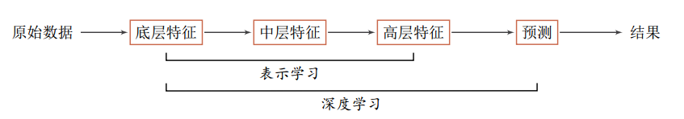

20200419

### 每日一图

### 每日一乐

[https://music.163.com/#/song?id=1403215687](https://music.163.com/#/song?id=1403215687)

### 每日一题

今日休息

请阅读完下面分享~

#### 深度学习

为了提高机器学习系统的准确率，我们就需要将输入信息转换为有效的特征，或者更一般性称为表示（Representation）。如果有一种算法可以自动地学习出有效的特征，并提高最终机器学习模型的性能，那么这种学习就是可以叫做表示学习（Representation Learning）。

语义鸿沟 表示学习的关键是解决语义鸿沟（Semantic Gap）问题。语义鸿沟问题是指输入数据的底层特征和高层语义信息之间的不一致性和差异性。比如给定一些关于“车”的图片，由于图片中每辆车的颜色和形状等属性都不尽相同，不同图片在像素级别上的表示（即底层特征）差异性也会非常大。但是我们人理解这些图片是建立在比较抽象的高层语义概念上的。如果一个预测模型直接建立在底层特征之上，会导致对预测模型的能力要求过高。如果可以有一个好的表示在某种程度上可以反映出数据的高层语义特征，那么我们就可以相对容易地构建后续的机器学习模型。

在表示学习中，有两个核心问题：一是“什么是一个好的表示？”；二是“如何学习到好的表示？”

为了学习一种好的表示，需要构建具有一定“深度”的模型，并通过学习算法来让模型自动学习出好的特征表示（从底层特征，到中层特征，再到高层特征），从而最终提升预测模型的准确率。所谓“深度”是指原始数据进行非线性特征转换的次数。如果把一个表示学习系统看作是一个有向图结构，深度也可以看作是从输入节点到输出节点所经过的最长路径的长度。

这样我们就需要一种学习方法可以从数据中学习一个“深度模型”，这就是深度学习（Deep Learning， DL）。深度学习是机器学习的一个子问题，其主要目的是从数据中自动学习到有效的特征表示。

下图给出了深度学习的数据处理流程。通过多层的特征转换，把原始数据变成为更高层次、更抽象的表示。这些学习到的表示可以替代人工设计的特征，从而避免“特征工程”。

原始数据->底层特征->中层特征->高层特征->预测->结果

表示学习：->底层特征->中层特征->高层特征

深度学习：>底层特征->中层特征->高层特征->预测

深度学习是将原始的数据特征通过多步的特征转换得到一种特征表示，并进一步输入到预测函数得到最终结果。和“浅层学习”不同，深度学习需要解决的关键问题是贡献度分配问题（Credit Assignment Problem， CAP） ，即一个系统中不同的组件（Components）或其参数对最终系统输出结果的贡献或影响。以下围棋为例，每当下完一盘棋，最后的结果要么赢要么输。我们会思考哪几步棋导致了最后的胜利，而又是哪几步棋导致了最后的败局。如何判断每一步棋的贡献就是贡献度分配问题，这也是一个非常困难的问题。从某种意义上讲，深度学习也可以看作是一种强化学习（Reinforcement Learning，RL），每个内部组件并不能直接得到监督信息，需要通过整个模型的最终监督信息（奖励）得到，并且有一定的延时性。

目前，深度学习采用的模型主要是神经网络模型，其主要原因是神经网络模型可以使用误差反向传播算法，从而可以比较好地解决贡献度分配问题。只要是超过一层神经网络都会存在贡献度分配问题，因此超过一层的神经网络都可以看作是深度学习模型。随着深度学习的快速发展，模型深度也从早期的5 ∼ 10层到目前的数百层。随着模型深度的不断增加，其特征表示的能力也越来越强，从而使后续的预测更加容易。

选自《神经网络与深度学习》-邱锡鹏